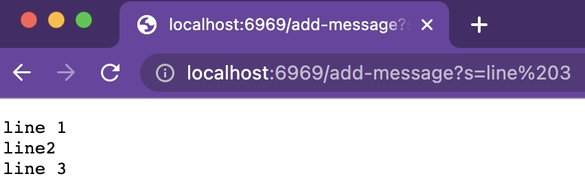
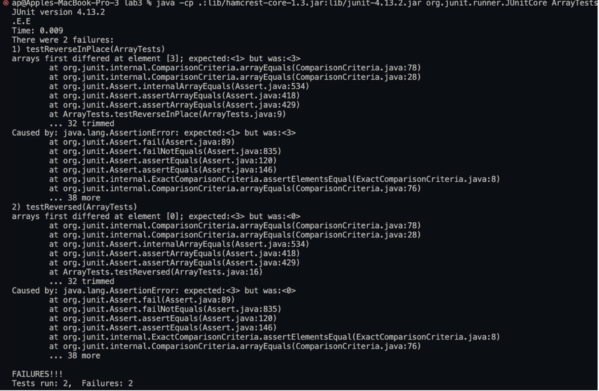

# Part 1 - Server for Appending Strings
Below is the Code for StringServer.
```
import java.io.IOException;
import java.net.URI;


class Handler implements URLHandler {
    // The one bit of state on the server: a number that will be manipulated by
    // various requests.
    String alreadyEntered = "";

    public String handleRequest(URI url) {
        // if the path has the proper syntax for adding messages to the webpage
        if (url.getPath().contains("/add-message")) {
            String w[] = url.getQuery().split("=");
            if (w.length > 0) {
                for (int i = 1; i < w.length; i++) {
                    alreadyEntered = alreadyEntered + w[i];
                }
                alreadyEntered += "\n";
            }
            return alreadyEntered;
        } 
        else {
            return alreadyEntered;
        }
    }
}

class StringServer {
    public static void main(String[] args) throws IOException {
        if(args.length == 0){
            System.out.println("Missing port number! Try any number between 1024 to 49151");
            return;
        }

        int port = Integer.parseInt(args[0]);

        Server.start(port, new Handler());
    }
}

```
Below, we can see that the code works.

The main method is called, which then calls the Server.start method which then calls handleRequest from the StringServer class which ipnuts the URL and handles the Query
effectively. 
The relevant argument is the URI type argument which contains all the important details: such as the domain and the query. 
As the query input changes, the URI getQuery() method returns a new String, which is then split using the split() function.

# Part 2 - Lab 3 Bugs in ArrayTests
## Buggy Code - 
```
// Changes the input array to be in reversed order
  static void reverseInPlace(int[] arr) {
    for(int i = 0; i < arr.length; i += 1) {
      arr[i] = arr[arr.length - i - 1];
    }
  }
```
## Corresponding JUnit Test -
```
@Test 
public void testReverseInPlace() {
    int[] input1 = { 0,1,2,3,4 };
    ArrayExamples.reverseInPlace(input1);
    assertArrayEquals(new int[]{ 4,3,2,1,0 }, input1);
}
```
## Corresponding Output & Symptom -

## Code After Debugging - 
```
// Changes the input array to be in reversed order
static void reverseInPlace(int[] arr) {
    int[] temp = new int[arr.length];
    for(int i = 0; i < arr.length; i += 1) {
      temp[i] = arr[arr.length - i - 1];
    }
    for(int i = 0; i < arr.length; i += 1) {
      arr[i] = temp[i];
    }
}
```
The fix addresses the bug because it fixes the Java technicality by creating another
temporary array and reverses the original array using the temporary array.

# Part 3 - Something New I Learned
1. I did not know how to handle web servers using Java, now I know how to handle basic requests using the URL in Java.
2. Before these labs, I did not know about JUnit testing in Java, and through the labs, I learned how easy it is to test code repetitively for many scenarios using JUnit.