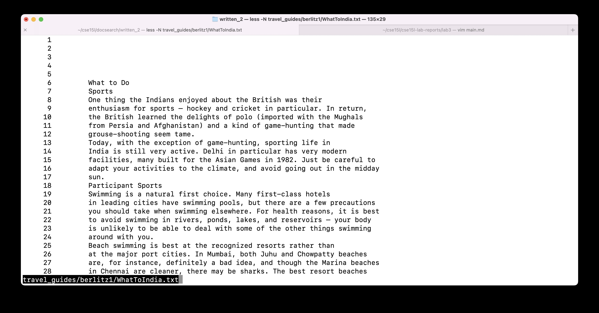
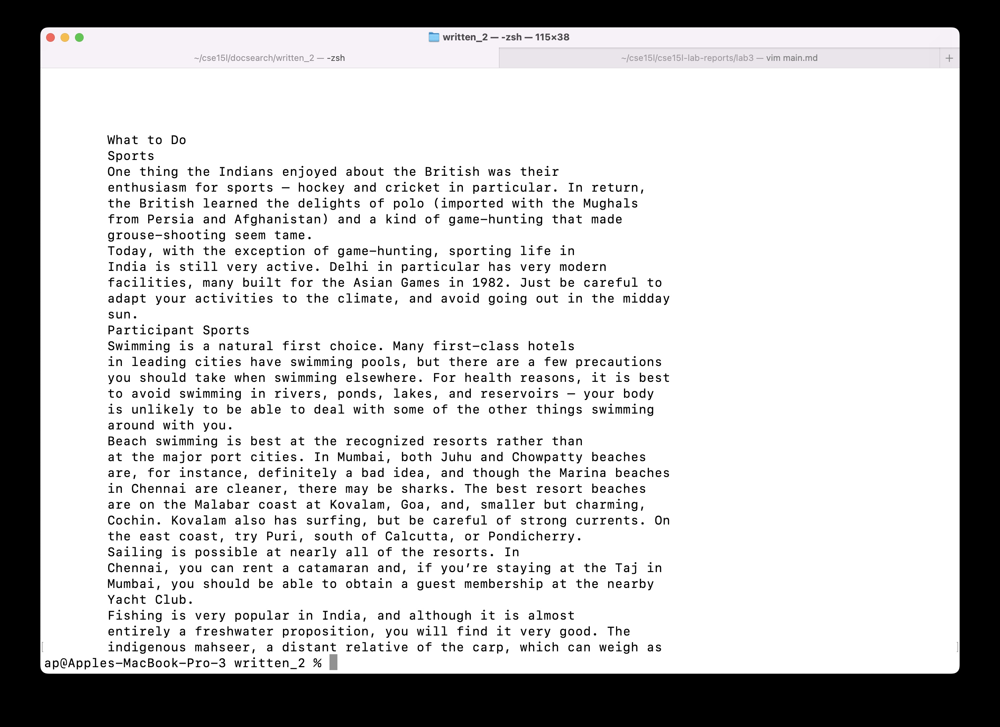
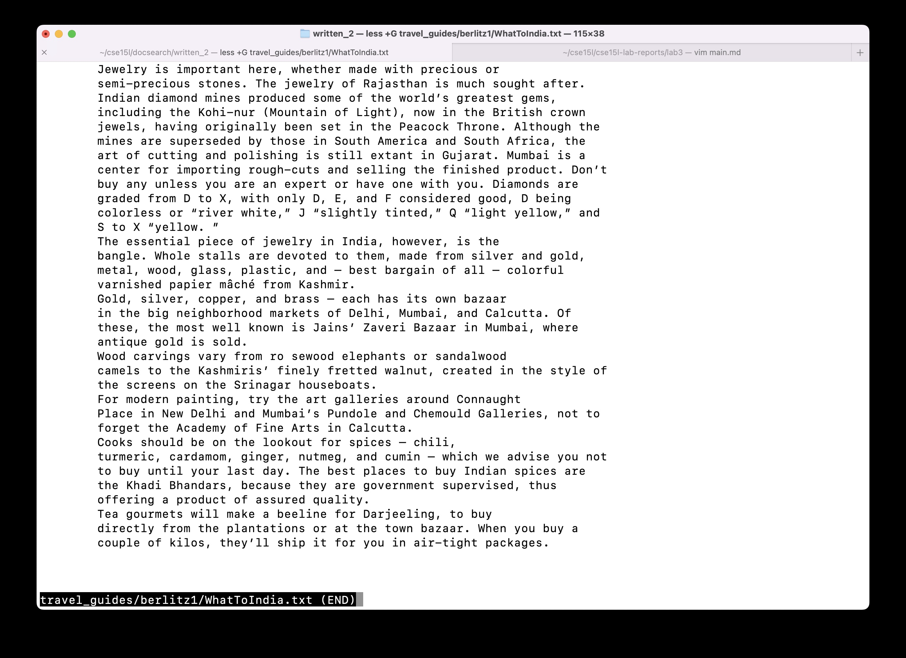

# Interesting Options with `less`

## What is `less`?
`less` is a command used to display the contents of file or command output, page by page. It can easily help you navigate through the pages - forward and backward through the file.

## Notable Differences with Similar Commands
It has faster load times when compared to `vim` or `nano` - making it the ideal command for reading large files.
It is similar to `more`, but has more commands similar to `vi` text editor, and supports horizontal scrolling, live monitoring, etc.
`less` is somewhat of an improved `more`.

## Syntax for using `less`
`less [OPTIONS] filename [filename2]`

## Interesting Options

I will be demonstrating all the examples on the file: written_2/travel_guides/berlitz1/WhatToIndia.txt and WhatToJapan.txt

However, I will only include one screenshot per option (one per 2 examples), because the output of less is a new window, and each option behaves similarly regardless of the file. 

For reference, running `less written_2/travel_guides/berlitz1/WhatToIndia.txt` opens the following window.

* -N : displays the line count for every line (as with most code editors like VSCode)
	for example: try running 
	`less -N written_2/travel_guides/berlitz1/WhatToIndia.txt` and 
	`less -N written_2/travel_guides/berlitz1/WhatToJapan.txt`

* -X : it keeps the contents of the file on the screen, until where the user has scrolled.
	for example: try running 
	`less -X written_2/travel_guides/berlitz1/WhatToIndia.txt` and
	`less -X written_2/travel_guides/berlitz1/WhatToJapan.txt`

* -s : chops long lines longer than the width of the screen to be chopped rather than wrapped. So, you would need to use the right arrow to see what's to the right, instead of it wrapping down. This preserves the line length and structure of the file.
	for example: try running
	`less -S written_2/travel_guides/berlitz1/WhatToIndia.txt` and 
	`less -S written_2/travel_guides/berlitz1/WhatToJapan.txt`
![Demonstrating the -S option on WhatToIndia.jpg(S.jpg)
* +G : opens at the end of the file instead of the beginning. In general, + as a modifier runs the following command in less while opening.
	for example: try running 
	`less -X written_2/travel_guides/berlitz1/WhatToIndia.txt` and 
	`less -X written_2/travel_guides/berlitz2/WhatToJapan.txt`

