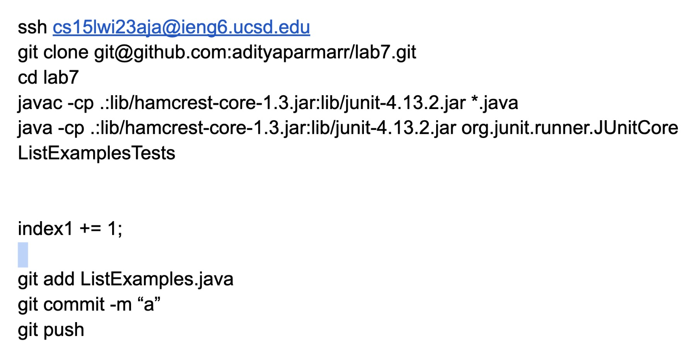
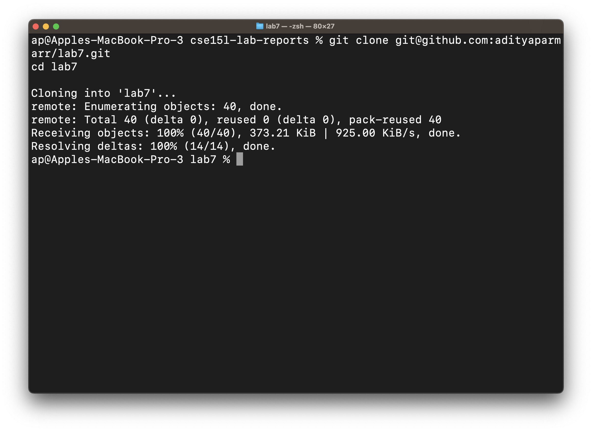
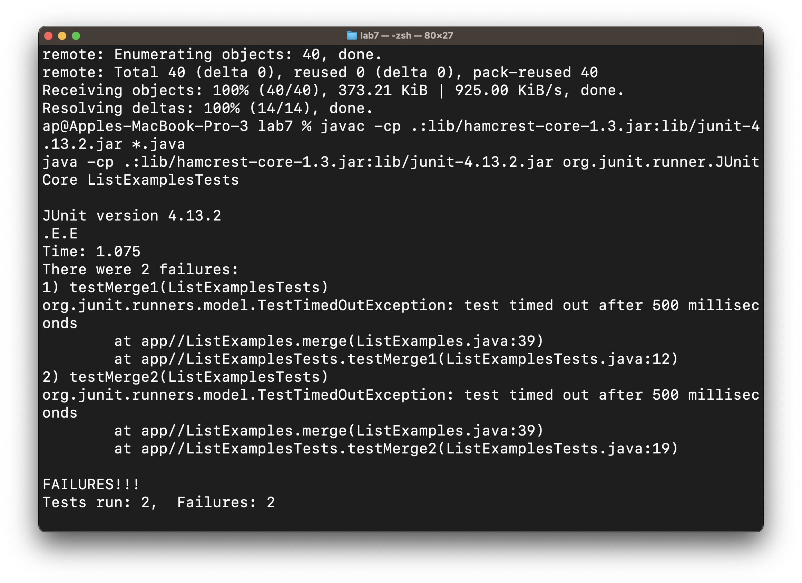
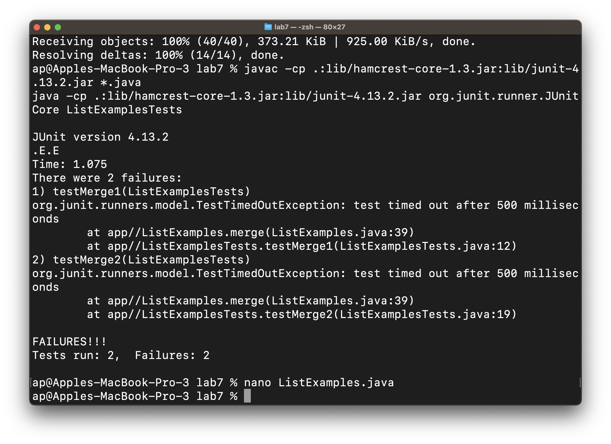
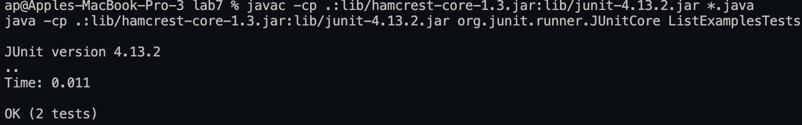
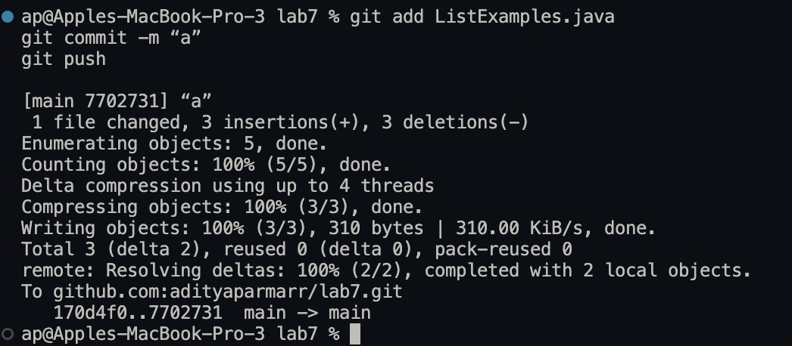

# Competition Steps

## Strategy

My trick was to have all the shell commands in a text file and copy pasting it into the terminal because I noticed that it automatically parsed the different lines of commands into individual commands, and it bypassed your need to press <Enter>.
I split it up into sections.
Note - I made sure it was allowed to do so.
Here is the screenshot of things I copy-pasted onto google docs (ready to execute the lab tasks as fast as possible)

1. First only the `ssh ssh cs15lwi23aja@ieng6.ucsd.edu` command because it was inconsistent if I tried to paste all the other commands with this
2. Then, the `cd` and the JUnit tests (compiling and running) in one <Ctrl+C> command
```
cd lab7
javac -cp .:lib/hamcrest-core-1.3.jar:lib/junit-4.13.2.jar *.java
java -cp .:lib/hamcrest-core-1.3.jar:lib/junit-4.13.2.jar org.junit.runner.JUnitCore ListExampleTests
```
3. Then I nano'd into ListExamples.java (using <Tab>s along the way to speed it up)
4. Then I used the <Ctrl+W> (where is) command to find the wrong `index1 +=` and replaced it with `index2 +=` using <Backspace>
5. Lastly, I copy-pasted all the git repository related steps (add, commit, and push)
```
git add ListExamples.java
git commit -m “a”
git push
```
Note - on my laptop, the <Enter> etc. are different, and the lab computer automatically pasted all the commands. I am unsure if it is a windows or a Visual Studio Code thing or just a ZSH (mac) terminal thing.
## Step 4 - Log into ieng6
`# copy paste the command and press <Enter>`
`ssh ssh cs15lwi23aja@ieng6.ucsd.edu <Enter>`
## Step 5 - Clone your fork of the repository from your Github account
`# copy paste, no need <Enter> `
`git clone git@github.com:adityaparmarr/lab7.git`
`cd lab7`

## Step 6 - Run the tests, demonstrating that they fail
`# Copy the junit test commands, no need <Enter>`
```
javac -cp .:lib/hamcrest-core-1.3.jar:lib/junit-4.13.2.jar *.java
java -cp .:lib/hamcrest-core-1.3.jar:lib/junit-4.13.2.jar org.junit.runner.JUnitCore ListExamplesTests
```

## Step 7 - Edit the code file to fix the failing test
```
# Can't copy paste here, so I used nano, and <Ctrl-W> index1 += and replaced it with index2 using <Backspace>
nano ListEx<Tab>.java`
<Ctrl-W> index1 +=
<Backspaces>
<Type>index2
<Ctrl-O>
<Enter>
<Ctrl-X>
# Repeating the same for index1 instead of index2 etc.
```

## Step 8 - Run the tests, demonstrating that they now succeed
```
javac List<Tab>.java
# Copy paste the JUnit tests as we did earlier
javac -cp .:lib/hamcrest-core-1.3.jar:lib/junit-4.13.2.jar *.java
java -cp .:lib/hamcrest-core-1.3.jar:lib/junit-4.13.2.jar org.junit.runner.JUnitCore ListExamplesTests
```

## Step 9 - Commit and push the resulting change to your Github account
```
# Copy Paste the git commands from the google doc
git add ListExamples.java
git commit -m “a”
git push
```

