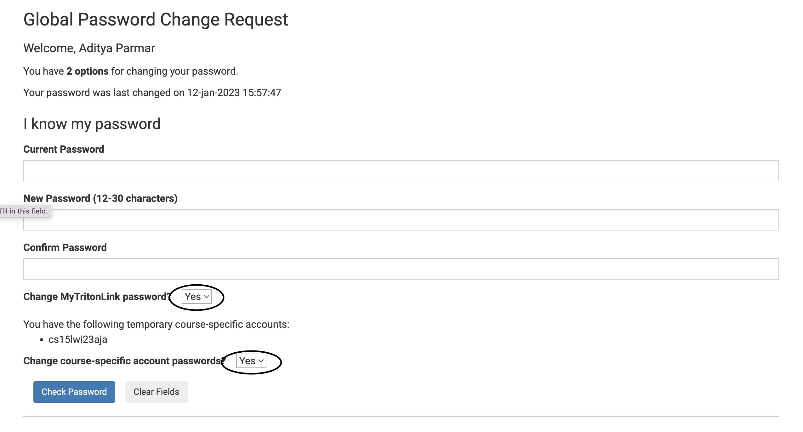
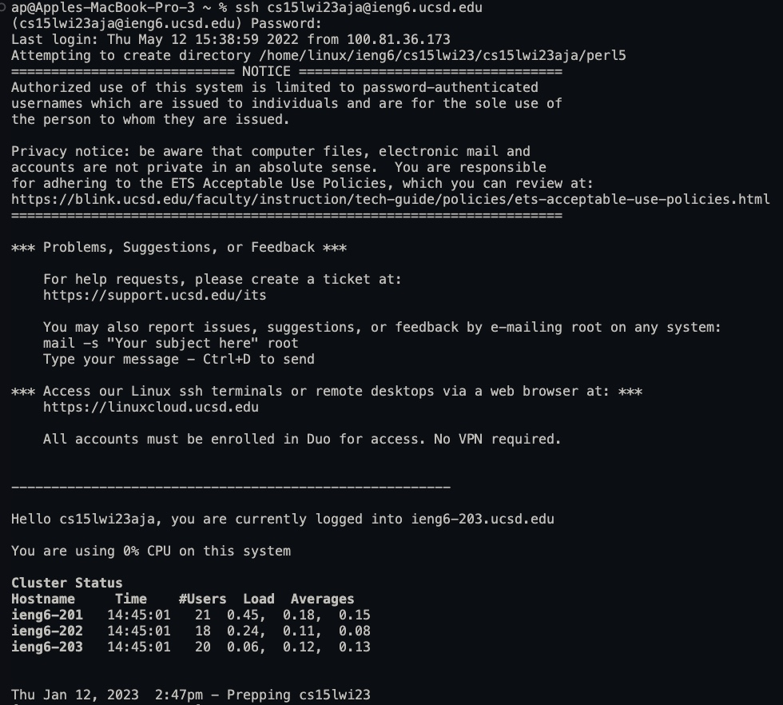

# Welcome to A Tutorial about Setting Up the CSE15L Environment!

---

## In this tutorial, we will learn how to: 
* Installing Visual Studio Code (VSCode)
* Remotely Connecting to the CSE Basement Servers (🤯🤯🤯)
* Trying out some Bash Commands 

---

## Installing VSCode
1. Go the Visual Studio Code website [here](https://code.visualstudio.com/).
2. Click on the **Download** Icon on the top right as shown by the green arrows in the image below.

3. Select your respective Operating System - MacOS, Linux, or Windows.
4. There should be a file downloading on your computer. 
5. Once it has been downloaded, click on it to open it, and follow the instructions as prompted by the installation software.

## Remotely Connecting to the CSE Basement Servers
### Preparing the Necessary Information
- In order to connect to the CSE Basement Servers, you need to open VSCode or any other terminal with bash (for example mac or linux terminal though you might or might not have to install some other software to get it working; your mileage may vary).
- You also need to know your 3-letter code assigned to your UCSD account for CSE 15L. You can find this using this website [here](https://sdacs.ucsd.edu/~icc/index.php). Fill in your PID (which begins with an A followed by some numbers) and Username in the **Account Lookup Field**, and log in to your account. Once you do that, look under **Additional Accounts** and look at the last 3 characters of the account.
### Connecting to the Server
1. Open the terminal (VSCode is preferred).
2. Enter the command: `ssh cs15lwi23zz@ieng6.ucsd.edu`
3. Follow the prompts (e.g. enter yes, and enter your password)
4. If your password is incorrect, or does not meet security requirements, you will be prompted to enter the password again; you might have to reset your CSE 15L account's password using the link provided [here](https://sdacs.ucsd.edu/~icc/password.php). (NOTE - this does not mean you need to reset your Active Directory Password. If you want to change only your CSE 15L account password, select "No" under change my TritonLink password. Select "Yes" for change course specific password.)
]
5. Upon successful connection to the server, it will look like the image below.
]

## Trying out some Bash Commands
Now, we can run some commands to do some basic operations.
For example, some cool commands are: 
```
- cd
- ls
- pwd
- ls -a
```
